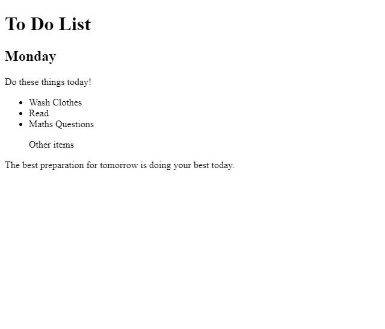

In this little project we learn how to combine selectors in a CSS file to apply style to an html file.

Given an HTML file that looks like this:

The goal here is, without making an changes to the HTML file, add a CSS file to style the HTML file so the final result looks like:

